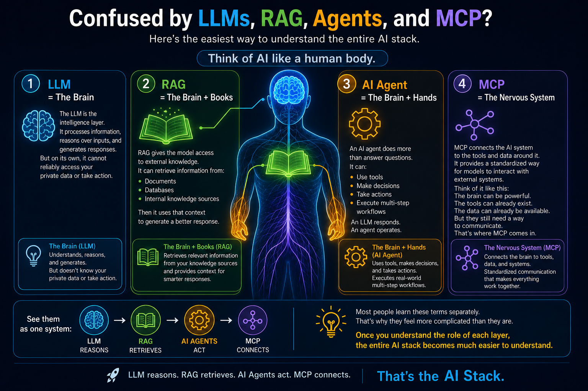

# 📖 AI Dictionary: Understanding AI Terminology

This dictionary provides simple explanations for common terms used in the world of Artificial Intelligence and Generative AI.

---

## 🏗️ Foundations

### **Artificial Intelligence (AI)**
The broad field of creating machines or software capable of performing tasks that typically require human intelligence, such as reasoning, learning, and problem-solving.

### **Machine Learning (ML)**
A subset of AI focused on building systems that learn from data to improve their performance on a specific task without being explicitly programmed for every step.

### **Deep Learning**
A more advanced type of machine learning inspired by the structure of the human brain (neural networks). It is exceptionally good at recognizing patterns in large amounts of data like images and text.

### **n-gram**
A simple language model that predicts the next item in a sequence (like a word or character) based on the previous $n-1$ items. It was widely used before the era of modern Large Language Models.

### **Boltzmann Distribution**
A mathematical formula from physics that describes how a system’s energy relates to its probability of being in a certain state. In AI, it is the foundation for the **Temperature** setting, helping models decide between "safe" high-probability words and "creative" low-probability ones. [Learn more](https://en.wikipedia.org/wiki/Boltzmann_distribution){:target="_blank" rel="noopener noreferrer"}

---

## 🤖 Generative AI & LLMs

### **Generative AI**
A type of AI that can create new content, such as text, images, code, or music, rather than just analyzing existing data.

### **Large Language Model (LLM)**
An AI model trained on vast amounts of text data. It can understand, generate, and manipulate human language in a way that feels natural. Examples include GPT-4, Claude, and Gemini.

### **Token**
The basic unit of text that an LLM processes. A token can be a whole word, a part of a word, or even just a character. Think of tokens as the "atoms" of language for the AI.

### **Context Window**
The amount of information (measured in tokens) that an LLM can "keep in mind" at one time during a conversation or task.

### **Hallucination**
When an AI generates information that sounds confident and fluent but is factually incorrect or nonsensical.

---

## 🛠️ Working with AI

### **Prompt**
The input or instruction you give to an AI model to get a specific response.

### **Prompt Engineering**
The process of crafting and refining prompts to get the most accurate, useful, or creative output from an AI.

### **Retrieval-Augmented Generation (RAG)**
A technique that gives an AI model access to specific, trusted documents (like a company's internal wiki) to provide more accurate and up-to-date answers.

### **Cache Augmented Generation (CAG)**
A technique that pre-loads relevant information into the model's context or a specialized cache to reduce latency and cost, ensuring the model has immediate access to specific knowledge without repeated retrieval steps.

### **AI Agent**
An AI system designed to not just talk, but to take actions—like searching the web, using tools, or completing multistep tasks to achieve a goal.

### **Temperature**
A setting that controls the "creativity" or randomness of an AI's output. Language models borrowed this term from physics (**[Boltzmann Distribution](#boltzmann-distribution)**), where it controls how often a system visits higher-energy states. Lowering temperature sharpens the distribution around the best-scoring word (making the model "colder" and more predictable), while raising it flattens the distribution so lower-scoring words get more chances (making the model "hotter" and more exploratory).

---

## 🛡️ Ethics & Safety

### **Bias**
When an AI model reflects human prejudices or unfair stereotypes present in the data it was trained on.

### **Alignment**
The challenge of ensuring that AI systems act in accordance with human values, goals, and ethical principles.