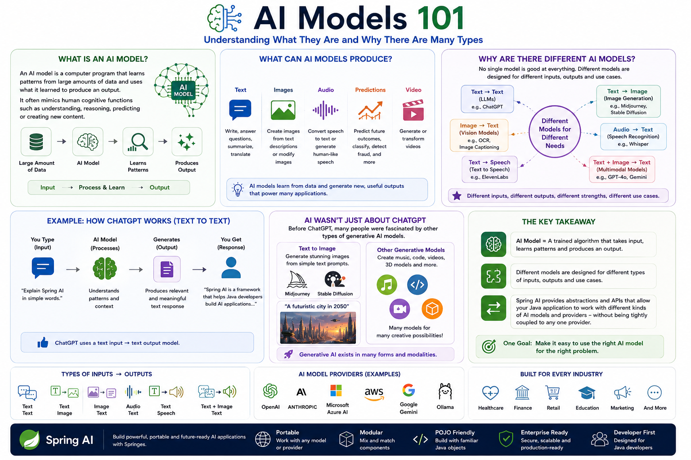

# AI Concepts

## What is an AI model

An AI model is a computer program that learns patterns from large amount of data and uses what it learned to produce an output.

For example:

```
Large Amount of Data → AI Model → Learn Patterns → Produces Output
```
The output could be:

- Text: answer a question or write an article
- Images: create an image from a description
- Audio: convert speech to text
- Speech: generate human-like speech
- Predictions: predict something based on historical data
- Video - generate or transform video



## What are there different AI models?
There isn't **one AI model that is good at everything**

Different models are designed for different inputs and outputs

Think of it like this:

| Input        | AI Model                 | Output          |
| ------------ | ------------------------ | --------------- |
| Text         | ChatGPT / LLM            | Text            |
| Text         | Image Generation Model   | Image           |
| Image        | Vision Model             | Text/Analysis   |
| Audio        | Speech Recognition Model | Text            |
| Text         | Text-to-Speech Model     | Audio           |
| Text + Image | Multimodal Model         | Text/Image/etc. |

#### Example: ChatGPT

When you type:

> "Explain Spring AI in simple words"

The flow is 

```
Your text → AI model → Understands patterns/context → Generates → Text Response
```

So ChatGPT is primarily interacting with you through **text input → text output**, although modern models can support other modalities too.

#### But AI isn't only about ChatGPT
The passage is also pointing out that generative AI existed in many forms before ChatGPT became popular.

For example:

                  AI Models
                     │
       ┌─────────────┼─────────────┐
       ↓             ↓             ↓
    Text Models   Image Models   Audio Models
       │             │             │
     ChatGPT      Midjourney    Speech Models
     Stable
     Diffusion

For example, with an image-generation model, you could provide:

> "A futuristic city in the year 2050."

And the model generates:

```
Text Prompt → Image Generation Model → Generated Image
```

**AI model = A trained algorithm that takes some type of input, processes what it has learned, and produces an output.**

### 1. AI models can work with different types of data

Spring AI supports models that can work with:

```
Input              Output
──────────────────────────────
Text       ──────► Text
Text       ──────► Image
Text       ──────► Audio
Audio      ──────► Text
Image      ──────► Text
```

For example

```
"Create an image of a futuristic city"
              ↓
        AI Model
              ↓
        🖼️ Image
```

So AI isn't limited to `text → text`.

### 2. What is a Prompt?

> A prompt is the input we give to an AI model to tell it what we want.

For example:

```
Prompt:
"Explain Spring AI in simple words."
```
The AI model processes that input and produces:

```
Response:
"Spring AI is a framework that helps Java developers..."
```

So, at the simplest level:

`Prompt → AI Model → Response`

#### 2.1 But a prompt is more than just a string
This is an important point from the passage.

When you use ChatGPT/Gemini/Claude, you might think:

`"Explain Spring AI"`

is the entire prompt.

But internally, a prompt can contain **multiple messages with different roles.**

For example:

```
System
" You are a helpful Java instructor."

User
"Explain Spring AI in simple words."
```
The AI model receives both pieces of information.

#### 2.2 What are Roles?

A typical conversation can contain different roles.

**System**
The **system message** defines how the AI should behave.

```
System:
"You are an expert Java instructor.
Explain concepts using simple examples."
```
Think of it as:

> Instructions for the AI

**User**
The **user message** contains what the user wants.

```
User:
"What is Spring AI?"
```
Think of it as:
> The actual request.

**Assistant**
The **assistant message** represents the AI's response.

```
Assistant:
"Spring AI is a framework for building AI applications..."
```

So you can visualize a conversation like:

````
┌─────────────────────────────┐
│ System                      │
│ How the AI should behave    │
└─────────────┬───────────────┘
              ↓
┌─────────────────────────────┐
│ User                        │
│ What the user wants         │
└─────────────┬───────────────┘
              ↓
        ┌───────────┐
        │ AI Model  │
        └─────┬─────┘
              ↓
┌─────────────────────────────┐
│ Assistant                   │
│ Generated response          │
└─────────────────────────────┘
````

#### 2.3 Why is prompting called an "art and science"?
Because the way you ask matters.

Compare these two prompts:

**Prompt 1:**

`Tell me about Spring AI.`

**Prompt 2:**

```
You are a Java instructor.

Explain Spring AI to a developer who is
new to AI.

Use simple language and a real-world
Payment Service example.

Keep the explanation under 300 words.
```

The second prompt gives the model:

- Role
- Context
- Objective
- Audience
- Example
- Constraints

So you're much more likely to get the response you want:

#### 2.4 Prompt Engineering

This leads to the term:
> Prompt Engineering

Prompt Engineering means:

> Designing and improving prompts so that an AI model produces better and more useful results.

For example: 

```
Bad / vague prompt
        ↓
"Explain AI"


Better prompt
        ↓
"Explain AI models to a Java developer
using a Payment Service example.
Use simple language."


Even better
        ↓
"Act as a senior Java instructor.
Explain AI models to a Java developer
who is new to Generative AI.

Use a Payment Service example.
Explain:
1. What an AI model is
2. Input and output
3. LLMs
4. Embeddings

Use simple language and Java-oriented examples."
```
The more clearly you communicate you intent, the more useful the result can be.

#### 2.5 Prompting is different from SQL
The passage makes an interesting comparison with SQL.

With SQL, you have a very precise language:

```sql
SELECT *
FROM payments
WHERE status = 'FAILED';
```

The database follows the defined syntax and retrieves the data.

With an AI model, you communicate more naturally:

```
"Show me the failed payments
from yesterday and explain
the possible reasons."
```
You're **communicating with the model**, rather than simply executing a rigid query.
That's why language becomes so important.

LLMs respond to patterns in language, and seemingly small changes in wording can sometimes produce significantly different results.

For example:

```
Solve this problem.
```
versus:

```
Solve this problem step by step.
Explain your reasoning before giving the final answer.
```
The second prompt encourages a more deliberate reasoning process.

```
                 PROMPT
                    │
        ┌───────────┼───────────┐
        ↓           ↓           ↓
      Role        Context      Task
        │           │           │
        └───────────┼───────────┘
                    ↓
                AI Model
                    ↓
              Generated Output
```

### 3. LLM reasoning: Zero-Shot Chain-of-Thought (Zero-shot-CoT)

#### 3.1 What are LLMs good at?

Large Language Models (LLMs) such as GPT are trained on huge amounts of text.

They can learn to perform tasks from examples.

There are three important concepts here:

```
Zero-shot       → No examples
Few-shot        → A few examples
Fine-tuning     → Train the model specifically
```
#### 3.2 Few-shot learning

Suppose you want the model to solve:

> If Puneeth has 5 apples and buys 3 more, how many does he have?

You could give examples first:

```
Example 1:
Puneeth has 2 apples and gets 4 more.
Answer: 6

Example 2:
Yakshith has 3 apples and gets 5 more.
Answer: 8

Now solve:
Mahi has 5 apples and buys 3 more.
```
The model learns the **pattern from the examples**

This is called **few-shot learning**

#### 3.3 What is Chain-of-Thought (CoT)?
Some problems require multiple reasoning steps.

For example:

> Puneeth has 5 apples. He gives 2 to Yakshith and buys 4 more. How many does he have?

Instead of directly answering:

> 7

We encourage the model to reason:

```
Start with 5
↓
Give away 2
↓
5 - 2 = 3
↓
Buy 4
↓
3 + 4 = 7
```

This step-by-step reasoning is called:

> Chain-of-Thought (CoT)

So:

**Chain of Thought = encourage the model to solve a problem step by step.**

#### 3.4 What is Zero-Shot CoT?
This is the interesting part of the research.

Normally, you might give the model examples showing how to reason step by step.

But researchers discovered that you can sometimes simply add:

> "Let's think step by step"

to the prompt

For example:

```
What is 23 × 17?

Let's think step by step.
```
The model is encouraged to perform intermediate reasoning before producing the answer.

That's called:

```
Zero-Shot Chain-of-Thought (Zero-Shot-CoT)
```
**Zero-shot** → No examples are provided.

**Chain-of-thought →** The model is encouraged to reason step by step.

#### 3.5 Zero-shot vs Few-shot vs CoT?

| Technique         | What you provide                              |
| ----------------- | --------------------------------------------- |
| **Zero-shot**     | Just the question                             |
| **Few-shot**      | Question + a few examples                     |
| **Few-shot CoT**  | Question + step-by-step examples              |
| **Zero-shot CoT** | Question + instruction to reason step by step |

For example:

**Zero-shot:**

`Solve 25 × 13.`

**Few-shot:**

```
2 × 3 = 6
4 × 5 = 20

Now solve:
25 × 13
```
**Zero-shot CoT:**

```
Solve 25 × 13.

Let's think step by step.

```

Arithmetic, logical reasoning, symbolic reasoning, and multistep problems are examples of tasks that generally require more deliberate reasoning.

> LLMs may already contain more reasoning capability than we realize. We can sometimes unlock that capability simply through prompting, without additional training or examples.

Think of it like this:

```
                 LLM
                  │
          ┌───────┴────────┐
          │                │
   Knowledge already    Reasoning
      learned            capability
          │                │
          └───────┬────────┘
                  │
                  ▼
          Better Prompt
                  │
                  ▼
        "Let's think step by step"
                  │
                  ▼
       Better reasoning performance
```

In a nutshell

> Zero-Shot Chain-of-Thought shows that instead of giving an LLM examples of how to reason, we can sometimes simply ask it to "think step by step" and get much better results on complex reasoning problems.

And this is an important foundation for understanding modern prompt engineering and reasoning techniques used in LLM applications.

### 4. What are Embeddings?

An embedding converts information such as text into numbers that represent its meaning.

For example:

```
"Spring AI is a Java framework"
              ↓
        Embedding Model
              ↓
[0.21, -0.45, 0.78, 0.12, ...]

```
These numbers are called an **embedding vector**

The important thing is:

> The numbers capture the meaning and relationships of the original information

This allows applications to do things like:

- Semantic search
- RAG
- Document search
- Finding similar content
- Recommendation systems
- Knowledge-base applications

