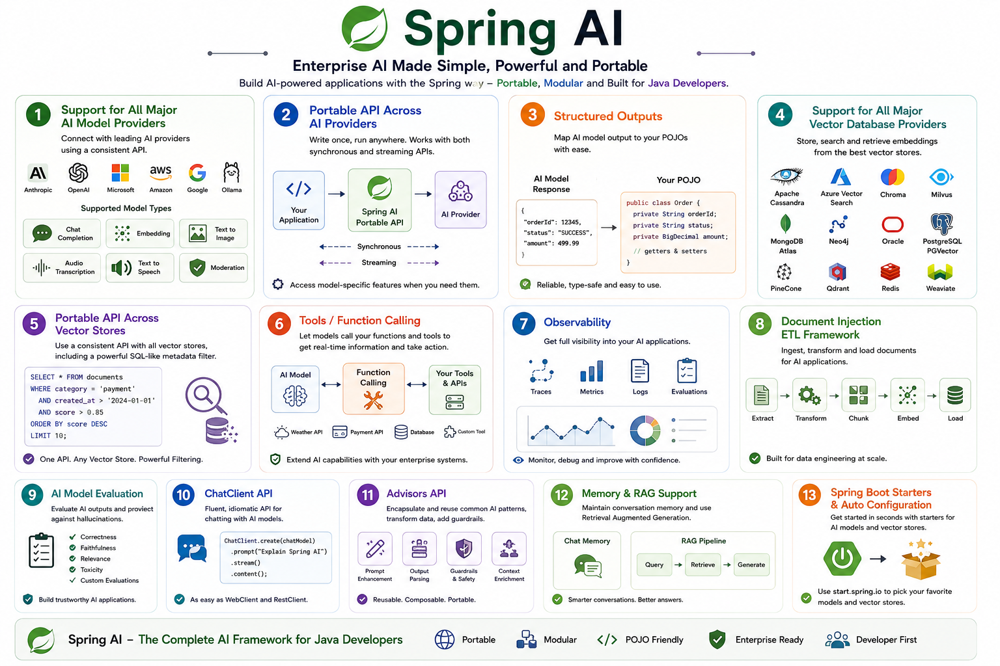

## Explore Spring AI 

_Spring AI is a framework that helps you build AI-powered applications using Java/Kotlin/Embabel and Spring principles._

For example, you can use it to build applications that:

- Chat with an LLM
- Generate text
- Create embeddings
- Search documents using Vector databases
- Build RAG applications
- Connect AI models to your business logic

Spring has always focused on principles like:

- **Dependency Injection** → components are loosely coupled
- **Modularity** → break an application into manageable components
- **POJOs** → use simple Java classes rather than complicated framework-specific classes
- **Portability** → avoid being locked into one technology

Spring AI brings these same ideas into AI development/engineering.


### **Dependency Injection**

_Dependency Injection_ is an important design principle. In the context of **Spring AI**, you can understand it like this:

Instead of creating AI components yourself:

```java
ChatModel chatmodel = new OpenAiChatModel(...);
```
Spring can provide the required components to your class:

```java
@Service
public class PaymentService {
   private final ChatModel chatModel;
   
   public PaymentService(ChatModel chatModel) {
      this.chatModel = chatModel;
   }
}
```

Here:

```
Spring → creates and configures → ChatModel → injects → PaymentService
```

Your PaymentService doesn't need to know **how** the `ChatModel` was created.

### **Why is this useful for AI?**

Suppose your application uses an Amazon Bedrock model today:

```
PaymentService → ChatModel → Amazon Bedrock
```

Later, you could configure another supported model/provider like Gemini, Ollama, Mistral or OpenAI.

The business logic can continue working with the `ChatModel` abstraction rather than being tightly coupled to the provider

That's where **Dependency Injection + Portability** work nicely together

### **Modularity Design**

Achieving modularity by separating the application into different components instead of putting everything into one huge AI application.

We can create separate components such as:

AI Application
- Chat Model
- Embedding Model
- Vector Store
- Prompt Management
- RAG
- Tools

Each part has a specific responsibility, and this makes the application easier to:

- Develop
- Test
- Replace Components
- Maintain

### **Portability**
When it comes to **portability**, for example, you might be using **Amazon Bedrock** today, but tomorrow, if you want to switch to another model provider, your application code doesn’t need to be completely rewritten.

Your Application → Spring AI → Amazon Bedrock

Your Application → Spring AI → OpenAI/Google ADK/Mistral/Ollama

So, Spring AI tries to keep your application code independent of the particular AI Model Provider.

### **Using Plain Old Java Object (POJO's) as the building blocks** 

In simple terms:

> Use normal Java classes to represent your application data and logic:

For example:

```java
public class Payment {
  
  private double accountBalance;
  private String paymentStatus;
  
}
```

Spring's philosophy is that your business logic should not have depended heavily on the framework. Spring AI follows the same idea.

### How the four principles fit together
You can remember the Spring AI philosophy like this:

| Principle                | Simple meaning                                           |
| ------------------------ | -------------------------------------------------------- |
| **Portability**          | Don't tightly depend on one AI provider                  |
| **Modular Design**       | Break AI functionality into reusable components          |
| **POJOs**                | Use simple Java objects for application data and logic   |
| **Dependency Injection** | Let Spring provide the components your application needs |


                 Spring AI Application
                         │
          ┌──────────────┼──────────────┐
          │              │              │
     Portability    Modular Design     POJOs
          │              │              │
    Switch AI model   Separate parts   Simple Java
          │              │              │
          └──────────────┼──────────────┘
                         │
                Dependency Injection
                        │
               Spring provides components
                        │
                        ▼
                 Your Application

In a nutshell, 

_**Spring AI**_ brings the familiar Spring way of developing applications into the AI world. It allows Java/Kotlin developers to build AI applications using modular components, simple Java/Kotlin objects, and APIs that make it easier to switch between different AI providers and technologies.

> Spring AI helps your application connect your company's data and business APIs with AI models

**Let's break it down**

Imagine you have a **Payment Service** in your application

You have three important things:

1. **Enterprise Data:** Customer data, Transaction data, Product data
2. **Enterprise APIs:** Payment API, Order API, Account API
3. **AI Models:** Amazon Bedrock, Azure OpenAPI, Google Gemini, OpenAI, etc.,

**How do we glue these and make it three work together?**

### 1. Enterprise Data
Your company already has a lot of data:

- Customer Information
- Payment transactions
- Orders
- Product Information
- Documents
- Database records

Spring AI can help your AI application access and use this data

For example:

**_Database → Spring AI → AI Model_**

The AI model can then answer questions based on your company's data.

### 2. Enterprise APIs

Your company also has APIs that perform business operations.

For example:

```
Payment API
Order API
Customer API
Account API
```

An AI application may need to call these APIs.

For example, a user asks:

> "What is the status of my payment"?

The flow could be 

 
**_User → AI Application → Payment API → Payment Service → Payment Data_**
 

Spring AI helps you build this kind of integration between the AI application and your existing APIs.

### 3. AI Models

Then you have AI models such as:

```
Amazon Bedrock
Azure OpenAI
Google AI
OpenAI
Ollama
```

Spring AI provides abstractions that make it easier for your application to work with different AI models

So your application can have:

                    Spring AI
                       │
        ┌──────────────┼──────────────┐
        ↓              ↓              ↓
    Enterprise       Enterprise      AI Models
      Data             APIs
        │                │              │
     Database         Payment API      OpenAI
     Documents        Order API        Bedrock
    Customer Data     Customer API      Azure

#### The key idea

Think of **Spring AI as the bridge**

_**Enterprise data → Spring AI (Bridge) → AI Models → Enterprise APIs**_

### Spring AI Features



- **Broad AI Provider Support:** Connects with leading AI ecosystems (OpenAI, Anthropic, Google, Amazon, Microsoft, Ollama) using consistent, portable APIs for both instant and streaming responses, while keeping access to provider-specific settings.
- **Comprehensive Model Capabilities:** Handles a wide array of AI tasks, including text chat, text embeddings, image generation, audio transcription, text-to-speech, content moderation, and structured output (mapping AI responses directly to Java POJOs).
- **Vector Database & RAG Integration:** Integrates with all major vector databases (e.g., Pinecone, PostgreSQL/PGVector, Redis, MongoDB Atlas, Chroma) featuring a unified metadata filtering API, conversation memory, and RAG (Retrieval Augmented Generation) support.
- **Extensible Tool & Data Pipelines:** Includes client-side function/tool calling for real-time data lookup, as well as a dedicated document ETL (Extract, Transform, Load) framework for data engineering.
- **Enterprise-Grade Utilities:** Built-in observability tools to monitor AI operations, alongside evaluation utilities to detect hallucinations and ensure output quality.
- **Spring Framework Idioms:** Features a fluent ChatClient API (similar to WebClient/RestClient), an Advisors API for common Generative AI patterns, and Spring Boot auto-configuration/starters available via start.spring.io.

<!-- Spring AI ChatClient Animated Execution Flow Player -->
<div id="spring-ai-player" style="font-family: -apple-system, BlinkMacSystemFont, 'Segoe UI', Roboto, Helvetica, Arial, sans-serif; background: #0f172a; color: #f8fafc; border-radius: 12px; padding: 24px; max-width: 800px; margin: 20px auto; box-shadow: 0 10px 25px -5px rgba(0, 0, 0, 0.5); border: 1px solid #1e293b;">

  <!-- Header -->
  <div style="display: flex; justify-content: space-between; align-items: center; border-bottom: 1px solid #334155; padding-bottom: 16px; margin-bottom: 20px;">
    <h3 style="margin: 0; font-size: 18px; color: #38bdf8; font-weight: 600;">⚡ Spring AI ChatClient Execution Pipeline</h3>
    <span id="step-badge" style="background: #0284c7; color: #ffffff; font-size: 12px; font-weight: 700; padding: 4px 10px; border-radius: 20px;">Step 1 / 8</span>
  </div>

  <!-- Dynamic Progress Bar -->
  <div style="width: 100%; background: #1e293b; height: 8px; border-radius: 4px; overflow: hidden; margin-bottom: 24px;">
    <div id="progress-bar" style="width: 12.5%; height: 100%; background: linear-gradient(90deg, #38bdf8, #818cf8); transition: width 0.3s ease;"></div>
  </div>

  <!-- Interactive Control Panel (Play / Pause / Next / Prev / Reset) -->
  <div style="display: flex; gap: 10px; justify-content: center; margin-bottom: 24px; flex-wrap: wrap;">
    <button id="btn-play-pause" onclick="togglePlayPause()" style="background: #2563eb; color: #ffffff; border: none; padding: 10px 20px; border-radius: 6px; font-weight: 600; cursor: pointer; display: flex; align-items: center; gap: 8px; transition: all 0.2s;">
      <span id="play-icon">▶</span> <span id="play-text">Play</span>
    </button>
    <button onclick="prevStep()" style="background: #334155; color: #f8fafc; border: none; padding: 10px 16px; border-radius: 6px; font-weight: 600; cursor: pointer; transition: all 0.2s;">
      ⏮ Prev
    </button>
    <button onclick="nextStep()" style="background: #334155; color: #f8fafc; border: none; padding: 10px 16px; border-radius: 6px; font-weight: 600; cursor: pointer; transition: all 0.2s;">
      Next ⏭
    </button>
    <button onclick="resetFlow()" style="background: #334155; color: #94a3b8; border: none; padding: 10px 16px; border-radius: 6px; font-weight: 600; cursor: pointer; transition: all 0.2s;">
      ↺ Reset
    </button>
  </div>

  <!-- Component Architecture Visual Nodes -->
  <div style="display: grid; grid-template-columns: repeat(4, 1fr); gap: 10px; margin-bottom: 24px;">
    <div id="node-0" class="flow-node" style="background: #1e293b; padding: 12px; border-radius: 8px; text-align: center; border: 2px solid #334155; font-size: 13px;">
      <div style="font-size: 18px; margin-bottom: 4px;">🌱</div>
      <div style="font-weight: 600; color: #e2e8f0;">Spring Context</div>
    </div>
    <div id="node-1" class="flow-node" style="background: #1e293b; padding: 12px; border-radius: 8px; text-align: center; border: 2px solid #334155; font-size: 13px;">
      <div style="font-size: 18px; margin-bottom: 4px;">🛠️</div>
      <div style="font-weight: 600; color: #e2e8f0;">ChatClient</div>
    </div>
    <div id="node-2" class="flow-node" style="background: #1e293b; padding: 12px; border-radius: 8px; text-align: center; border: 2px solid #334155; font-size: 13px;">
      <div style="font-size: 18px; margin-bottom: 4px;">🧠</div>
      <div style="font-weight: 600; color: #e2e8f0;">Advisors</div>
    </div>
    <div id="node-3" class="flow-node" style="background: #1e293b; padding: 12px; border-radius: 8px; text-align: center; border: 2px solid #334155; font-size: 13px;">
      <div style="font-size: 18px; margin-bottom: 4px;">🌐</div>
      <div style="font-weight: 600; color: #e2e8f0;">LLM REST API</div>
    </div>
  </div>

  <!-- Step Detail Card -->
  <div style="background: #1e293b; border-left: 4px solid #38bdf8; padding: 16px 20px; border-radius: 0 8px 8px 0;">
    <div id="step-code" style="font-family: monospace; color: #38bdf8; font-size: 13px; font-weight: 700; margin-bottom: 6px;">runner(ChatClient.Builder builder)</div>
    <h4 id="step-title" style="margin: 0 0 8px 0; font-size: 16px; color: #f1f5f9;">1. Spring Boot Auto-Configuration</h4>
    <p id="step-desc" style="margin: 0; font-size: 14px; color: #94a3b8; line-height: 1.5;">
      Spring Boot injects an auto-configured ChatClient.Builder pre-wired with default parameters and your primary ChatModel bean (OpenAI, Ollama, Anthropic, etc.).
    </p>
  </div>

</div>

<!-- Player Script -->
<script>
  const steps = [
    {
      nodeIdx: 0,
      code: "runner(ChatClient.Builder builder)",
      title: "1. Spring Boot Auto-Configuration",
      desc: "Spring Boot initializes the ApplicationContext and injects an auto-configured ChatClient.Builder bean pre-loaded with environment properties."
    },
    {
      nodeIdx: 1,
      code: "var chatClient = builder.build();",
      title: "2. Immutable ChatClient Construction",
      desc: "Calling .build() instantiates a DefaultChatClient. This fixes default settings, advisor chains, and links the underlying ChatModel."
    },
    {
      nodeIdx: 1,
      code: ".prompt(\"Tell me a joke\")",
      title: "3. Prompt Request Assembly",
      desc: "Constructs a ChatClientRequestSpec. Your raw prompt text is wrapped inside a structured UserMessage domain object."
    },
    {
      nodeIdx: 1,
      code: ".call()",
      title: "4. Synchronous Execution Trigger",
      desc: "Initializes a CallResponseSpec, setting up the synchronous execution pipeline to process request transformations."
    },
    {
      nodeIdx: 2,
      code: "AdvisorChain.apply(request)",
      title: "5. Advisor Pipeline Interception",
      desc: "The request flows through configured Advisors to inject conversation memory history, RAG document context, and record metrics."
    },
    {
      nodeIdx: 2,
      code: "ChatModel.call(Prompt prompt)",
      title: "6. Model Adapter Serialization",
      desc: "The generic Prompt domain model reaches the provider-specific adapter (e.g. OpenAiChatModel) and converts to target API JSON format."
    },
    {
      nodeIdx: 3,
      code: "POST /v1/chat/completions (HTTP 200)",
      title: "7. Remote REST API Exchange",
      desc: "Spring RestClient/WebClient executes an outbound HTTP POST request over TLS to the AI provider endpoint and receives JSON."
    },
    {
      nodeIdx: 1,
      code: ".content() -> String",
      title: "8. Unmarshalling & Content Extraction",
      desc: "JSON response deserializes into a ChatResponse object. Calling .content() extracts the generated text string for System.out.println."
    }
  ];

  let currentStep = 0;
  let isPlaying = false;
  let timer = null;

  function updateUI() {
    const step = steps[currentStep];
    
    // Update Badge & Progress Bar
    document.getElementById('step-badge').textContent = `Step ${currentStep + 1} / ${steps.length}`;
    document.getElementById('progress-bar').style.width = `${((currentStep + 1) / steps.length) * 100}%`;
    
    // Update Step Detail Card
    document.getElementById('step-code').textContent = step.code;
    document.getElementById('step-title').textContent = step.title;
    document.getElementById('step-desc').textContent = step.desc;

    // Highlight Active Architecture Node
    for (let i = 0; i < 4; i++) {
      const node = document.getElementById(`node-${i}`);
      if (i === step.nodeIdx) {
        node.style.borderColor = '#38bdf8';
        node.style.background = '#0284c722';
        node.style.transform = 'scale(1.03)';
      } else {
        node.style.borderColor = '#334155';
        node.style.background = '#1e293b';
        node.style.transform = 'scale(1)';
      }
    }
  }

  function togglePlayPause() {
    isPlaying = !isPlaying;
    const btn = document.getElementById('btn-play-pause');
    const icon = document.getElementById('play-icon');
    const text = document.getElementById('play-text');

    if (isPlaying) {
      icon.textContent = '⏸';
      text.textContent = 'Pause';
      btn.style.background = '#dc2626';
      
      timer = setInterval(() => {
        if (currentStep < steps.length - 1) {
          currentStep++;
        } else {
          currentStep = 0; // Loop back to start
        }
        updateUI();
      }, 2000);
    } else {
      pauseFlow();
    }
  }

  function pauseFlow() {
    isPlaying = false;
    clearInterval(timer);
    const btn = document.getElementById('btn-play-pause');
    document.getElementById('play-icon').textContent = '▶';
    document.getElementById('play-text').textContent = 'Play';
    btn.style.background = '#2563eb';
  }

  function nextStep() {
    pauseFlow();
    if (currentStep < steps.length - 1) {
      currentStep++;
      updateUI();
    }
  }

  function prevStep() {
    pauseFlow();
    if (currentStep > 0) {
      currentStep--;
      updateUI();
    }
  }

  function resetFlow() {
    pauseFlow();
    currentStep = 0;
    updateUI();
  }

  // Initialize view
  updateUI();
</script>