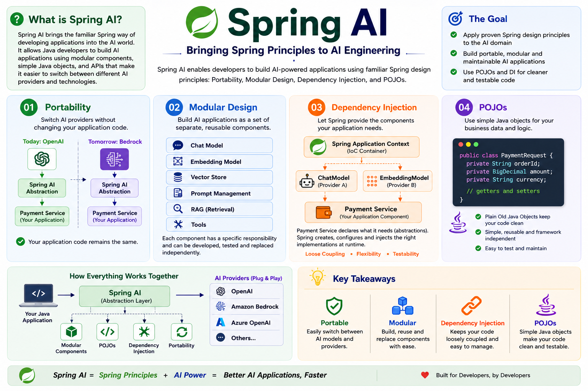

## Explore Spring AI 

_Spring AI is a framework that helps you build AI-powered applications using Java/Kotlin/Embabel and Spring principles._

For example, you can use it to build applications that:

- Chat with an LLM
- Generate text
- Create embeddings
- Search documents using Vector databases
- Build RAG applications
- Connect AI models to your business logic

Spring has always focused on principles like:

- **Dependency Injection** → components are loosely coupled
- **Modularity** → break an application into manageable components
- **POJOs** → use simple Java classes rather than complicated framework-specific classes
- **Portability** → avoid being locked into one technology

Spring AI brings these same ideas into AI development/engineering.



### **Dependency Injection**

_Dependency Injection_ is an important design principle. In the context of **Spring AI**, you can understand it like this:

Instead of creating AI components yourself:

```java
ChatModel chatmodel = new OpenAiChatModel(...);
```
Spring can provide the required components to your class:

```java
@Service
public class PaymentService {
   private final ChatModel chatModel;
   
   public PaymentService(ChatModel chatModel) {
      this.chatModel = chatModel;
   }
}
```

Here:

```
Spring → creates and configures → ChatModel → injects → PaymentService
```

Your PaymentService doesn't need to know **how** the `ChatModel` was created.

### **Why is this useful for AI?**

Suppose your application uses an Amazon Bedrock model today:

```
PaymentService → ChatModel → Amazon Bedrock
```

Later, you could configure another supported model/provider like Gemini, Ollama, Mistral or OpenAI.

The business logic can continue working with the `ChatModel` abstraction rather than being tightly coupled to the provider

That's where **Dependency Injection + Portability** work nicely together

### **Modularity Design**

Achieving modularity by separating the application into different components instead of putting everything into one huge AI application.

We can create separate components such as:

AI Application
- Chat Model
- Embedding Model
- Vector Store
- Prompt Management
- RAG
- Tools

Each part has a specific responsibility, and this makes the application easier to:

- Develop
- Test
- Replace Components
- Maintain

### **Portability**
When it comes to **portability**, for example, you might be using **Amazon Bedrock** today, but tomorrow, if you want to switch to another model provider, your application code doesn’t need to be completely rewritten.

Your Application → Spring AI → Amazon Bedrock

Your Application → Spring AI → OpenAI/Google ADK/Mistral/Ollama

So, Spring AI tries to keep your application code independent of the particular AI Model Provider.

### **Using Plain Old Java Object (POJO's) as the building blocks** 

In simple terms:

> Use normal Java classes to represent your application data and logic:

For example:

```java
public class Payment {
  
  private double accountBalance;
  private String paymentStatus;
  
}
```

Spring's philosophy is that your business logic should not have depended heavily on the framework. Spring AI follows the same idea.

### How the four principles fit together
You can remember the Spring AI philosophy like this:

| Principle                | Simple meaning                                           |
| ------------------------ | -------------------------------------------------------- |
| **Portability**          | Don't tightly depend on one AI provider                  |
| **Modular Design**       | Break AI functionality into reusable components          |
| **POJOs**                | Use simple Java objects for application data and logic   |
| **Dependency Injection** | Let Spring provide the components your application needs |


                 Spring AI Application
                         │
          ┌──────────────┼──────────────┐
          │              │              │
     Portability    Modular Design     POJOs
          │              │              │
    Switch AI model   Separate parts   Simple Java
          │              │              │
          └──────────────┼──────────────┘
                         │
                Dependency Injection
                        │
               Spring provides components
                        │
                        ▼
                 Your Application

In a nutshell, 

_**Spring AI**_ brings the familiar Spring way of developing applications into the AI world. It allows Java/Kotlin developers to build AI applications using modular components, simple Java/Kotlin objects, and APIs that make it easier to switch between different AI providers and technologies.

> Spring AI helps your application connect your company's data and business APIs with AI models

**Let's break it down**

Imagine you have a **Payment Service** in your application

You have three important things:

1. **Enterprise Data:** Customer data, Transaction data, Product data
2. **Enterprise APIs:** Payment API, Order API, Account API
3. **AI Models:** Amazon Bedrock, Azure OpenAPI, Google Gemini, OpenAI, etc.,

**How do we glue these and make it three work together?**

### 1. Enterprise Data
Your company already has a lot of data:

- Customer Information
- Payment transactions
- Orders
- Product Information
- Documents
- Database records

Spring AI can help your AI application access and use this data


